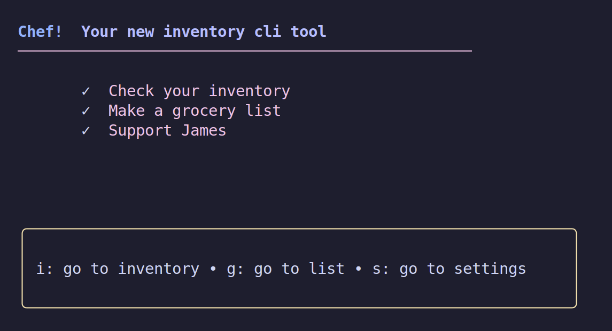
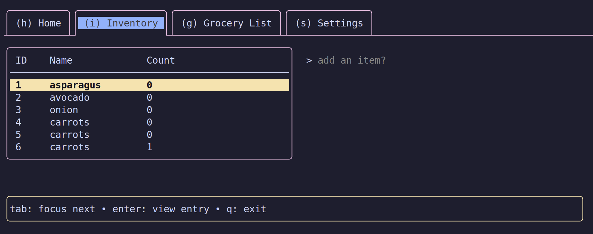

# Chef! A personal home inventory cli app.

## Running The App

1. Make sure go1.24.4 is installed on your machine.
2. Clone this repository and `cd` into the folder.
3. Install dependencies with `go mod tidy`
4. Run the app with `go run main.go init` or build an executable with `go build main.go`
5. Manage to your grocery list:

- `go run main.go init` to start the application.
- `go run main.go help` to show the help menu (upcoming).

## Screenshots

